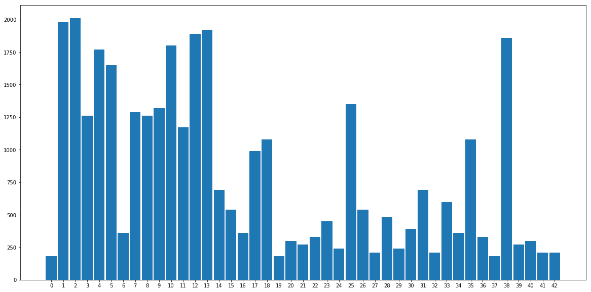
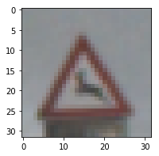
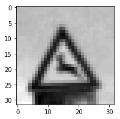
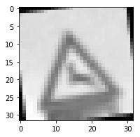
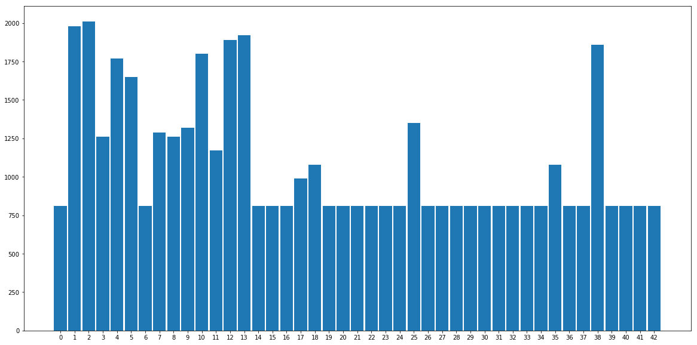

# **Traffic Sign Recognition** 

## Writeup
---

**Build a Traffic Sign Recognition Project**

The goals / steps of this project are the following:
* Load the data set (see below for links to the project data set)
* Explore, summarize and visualize the data set
* Design, train and test a model architecture
* Use the model to make predictions on new images
* Analyze the softmax probabilities of the new images
* Summarize the results with a written report

## Rubric Points
### Here I will consider the [rubric points](https://review.udacity.com/#!/rubrics/481/view) individually and describe how I addressed each point in my implementation.  

---
### Writeup / README

#### 1. The Writeup / README that includes all the rubric points and each of them are addressed. 

This file is the Writeup for the project. Here is a link to the [project code](https://github.com/navinrahim/CarND-Traffic-Sign-Classifier-Project/Traffic_Sign_Classifier.ipynb). The Github repository also contains the [HTML output](https://github.com/navinrahim/CarND-Traffic-Sign-Classifier-Project/Traffic_Sign_Classifier.html) of the code.

### Data Set Summary & Exploration

#### 1. Basic summary of the data set.

I used the python functions to understand the traffic signs dataset.

* The size of training set is **34799**.
* The size of the validation set is **4410**.
* The size of test set is **12630**.
* The shape of a traffic sign image is 43x48. The shape varies with the images.
* The number of unique classes/labels in the data set is **43**.

#### 2. An exploratory visualization of the dataset.

Here is an exploratory visualization of the data set. It is a bar chart showing how the data is distributed along the different classes/labels.



### Design and Test a Model Architecture

#### 1. Description of the preprocessing of the image data. 

The below image is the one taken from the dataset.



As a first step, I decided to convert the images to grayscale since the colors of the traffic signs provide little information about the traffic signs. The importance is for the shapes when trying to identify traffic signs. The below image shows the grayscaled version of a traffic sign image.



As a last step, I normalized the image data because a dataset with mean 0 and standard deviation of 1 helps in scaling data and also helps in making sure that all input dimensions are given the same importance.

I decided to generate additional data because some of the classes had very less data in them while some had a lot of data. This might result in the neural network to have a tendency to choose the class with more data as it has not seen enough data for the classes with lesser data in them.

To add more data to the the data set, I used the technique of rotation of the images. I selected the class that had lesser than the mean number of images in the dataset, took random images from them and rotated in a random angle between 0 and 10 degrees to obtain the rotated image. After having enough number of images to reach the mean number of images in the dataset, I appended them to the training dataset. This helped the neural network to get hands on more data which helped in improving the accuracy of the network. The below image shows a rotated version of an image.



The below bar chart shows the number of images per class after the augmentation is done.



#### 2. Final model architecture.

My final model consisted of the following layers:

| Layer         		|     Description	        					| 
|:---------------------:|:---------------------------------------------:| 
| Input         		| 32x32x1 RGB image   							| 
| Convolution 5x5   	| 1x1 stride, valid padding, outputs 28x28x6 	|
| RELU					|			Activation function									|
| Max pooling	      	| 2x2 stride,  outputs 14x14x6 				|
| Convolution 5x5	    | 1x1 stride, valid padding, outputs 10x10x16 									|
|RELU		| Activation function       									|
| Max pooling				| 2x2 stride,  outputs 5x5x16        									|
|		Flattening				|	outputs 400											|
|		Fully Connected				|	outputs 120											|
 |		RELU			|	activation function											|
 |		Dropout				|												|
 |		Fully Connected				|	outputs 80											|
 |		RELU			|	activation function												|
 |		Fully Connected				|	outputs 43											|

The netork consists of two convolutional neural networks and three fully connected networks. The LeNet model was used as the starting point. This model takes in the grayscaled 32x32x1 image and outputs the logits in the form of an array of size 43, which is the total number of output classes. A dropout layer was added in between to mitigate overfitting in the model.

#### 3. Training of the model.

To train the model, I used a batch size of 128 and a learning rate of 0.001. The epochs was chosen to be 30. Different values of these hyperparameters were used and the model was tuned to obtain the desired accuracy.

The logits of the network was used to calculate the mean loss of the network. The code below shows the calculation of the mean.
```
cross_entropy = tf.nn.softmax_cross_entropy_with_logits(labels=one_hot_y, logits=logits)
loss_operation = tf.reduce_mean(cross_entropy)
```

The Adam optimizer was used to calculate the gradient descent, minimize the loss and updating the weights in the backpropagation. Adam optimizer is an optimizer which also updates the learning rates using an adaptive method.

```
optimizer = tf.train.AdamOptimizer(learning_rate = rate)
training_operation = optimizer.minimize(loss_operation)
```
The keep_prob parameter for the dropout is set as 50% for the training process to avoid overfitting.

#### 4. Approach taken for finding the solution and getting the validation set accuracy to be at least 0.93. 

My final model results were:
* training set accuracy of 99.8%
* validation set accuracy of 96.2%
* test set accuracy of 94.2%

The LeNet architecture was taken as the starting point for this classifier. This was chosen since the LeNet model worked well to identify digits 0-9 from its shape. Since, the traffic sign classifier had to identify shapes and did not have much importance for the color factor, the LeNet model is an ideal candidate to identify the traffic signs. For this, the images were preprocessed to make it grayscaled.

Upon running the LeNet architecture on the traffic sign dataset, the model showed good accuracy of close to 100% in the first 40 epochs, but the validation accuracy reached only around 88%. This was identified as due to overfitting. So, an additional dropout layer was applied on the first fully connected layer and the epochs which were 100 were bought down to 30. This showed improved results, as the validation accuracy got a much better improvement and reached closed to 96% while the training accuracy got near 100%. 

Thus, the LeNet model with just a single dropout layer added to it shows a 96% validation accuracy in identifying the traffic signs. The usage of the droput layer brought the validation and training loss curves close in the loss graph as shown below.


### Testing the model on New Images

#### 1. Chose five German traffic signs found on the web and provided them in the report. For each image, discussing what quality or qualities might be difficult to classify.

Here are five German traffic signs that I found on the web:


The first image might be diffcult to classify since it is slightly translated to the left. This image is unlike the other images in the dataset that it is having a bit of noise and a background is present in the image.

The second and third images are rotated at a slight angle and also their backgrounds vary sharply with respect to the traffic signs. The last two images have a slighltly high brightness and the background on all sides are different. These factors may make it difficult for the neural network to classify the image correctly.

#### 2. Model's predictions on the new traffic signs and comparison with the results to prediction on the test set.

Here are the results of the prediction:

| Image			        |     Prediction	        					| 
|:---------------------:|:---------------------------------------------:| 
| Double Curve      		| Speed limit (60km/h)									| 
| No Entry    			| No Entry										|
| Speed limit (30km/h)				| Speed limit (30km/h)|
| Children crossing      		| Children crossing					 				|
| Yield			| Yield     							|


The model was able to correctly guess 4 of the 5 traffic signs, which gives an accuracy of 80%. Since the number of images that were used is very low, the percentage value is low. But, having that it detected the 4 images accurately and only missed one, it goes favourably with the test accuracy of 94%. A more accurate comparison can be done only after running the model on more new images.

#### 3. Certainainity of the model when predicting on each of the five new images by looking at the softmax probabilities for each prediction.

For the first image, the model fails to identify the trafiic sign is a double curve. The top 5 predictions do not have the double curve at all. The top two predictions have a significant value on their probabilities and they are listed below:

| Probability         	|     Prediction	        					| 
|:---------------------:|:---------------------------------------------:| 
| .613       			| Speed limit (60km/h) 									| 
| .01   				| Dangerous curve to the right 										|

For the second, third and the last image, the model is entirely sure about the traffic sign (probability of 1) and the image contains the predicted image.

For the fourth image, the model predicts the traffic sign correctly, but the surety of the model is low (probability of 0.493). The table below shows the top 5 probabilities predicted by the model:

| Probability         	|     Prediction	        					| 
|:---------------------:|:---------------------------------------------:| 
| .493         			| Children Crossing  									| 
| .325    				| General Caution										|
| .128					| Right-of-way at the next intersection										|
| .029	      			| Road narrows on the right					 				|
| .024				    | Pedestrians      							|


